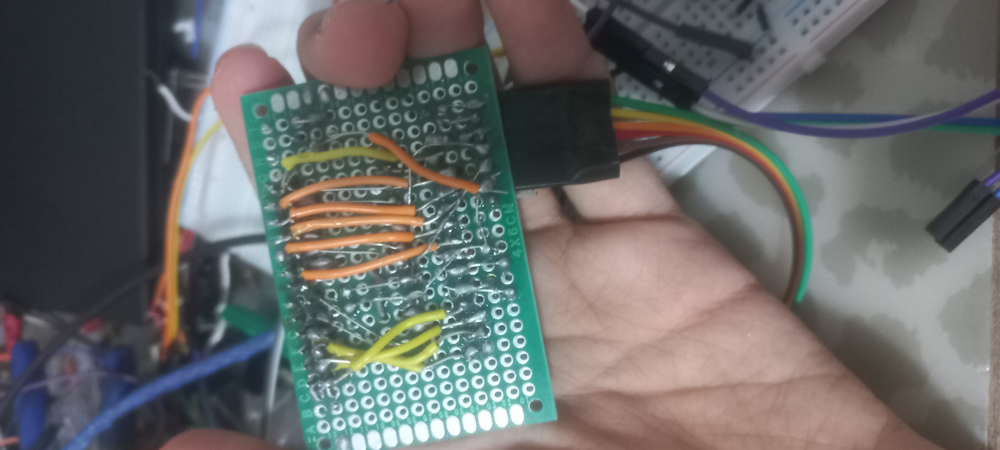
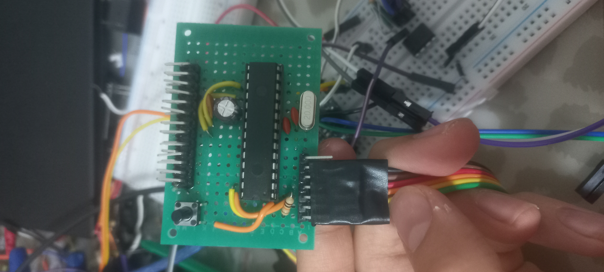

<h1 align="center">MagicPIC</h1>

<i>"Inspired by a 16-year-old MagicFINDER Plus 3 and the curiosity to understand what was inside."</i> 
<b>Brought to you by OBM</b>

---

MagicPIC, klasik Microchip PIC mikrodenetleyicilerini daha yakından tanımak, belgelemek ve
geliştirmek amacıyla oluşturulmuş açık kaynaklı bir gömülü sistem projesidir.

Proje **PIC16F886** mikrodenetleyicisini temel alır; donanım tasarımı, çevre birimi sürücüleri,
örnek uygulamalar ve kapsamlı Türkçe dokümantasyon geliştirmeyi hedefler.

**Bu repo yalnızca "çalışan kod parçaları" koleksiyonu değildir.** Katmanlı, test edilebilir ve
yeniden kullanılabilir bir firmware mimarisi sunar: aynı LCD sürücüsü, tek bir makro
değiştirilerek hem 6 pinli paralel bağlantıda hem 3 pinli 74HC595 bağlantısında çalışır.

---

## İçindekiler

- [Neler Çalışıyor?](#neler-çalışıyor)
- [Repo Yapısı](#repo-yapısı)
- [Hızlı Başlangıç](#hızlı-başlangıç)
- [Donanım](#donanım)
- [Programlama: LVP ve HVP](#programlama-lvp-ve-hvp)
- [Firmware Mimarisi](#firmware-mimarisi)
- [Pin Haritası](#pin-haritası)
- [Sürücü Kullanımı](#sürücü-kullanımı)
- [Kendi Projenizi Eklemek](#kendi-projenizi-eklemek)
- [Yeni Sürücü Eklemek](#yeni-sürücü-eklemek)
- [Test ve Doğrulama](#test-ve-doğrulama)
- [Sorun Giderme](#sorun-giderme)
- [Yol Haritası](#yol-haritası)
- [Katkıda Bulunma](#katkıda-bulunma)
- [Lisans](#lisans)
- [FAQ](#faq-sıkça-sorulan-sorular)

---

## Neler Çalışıyor?

Aşağıdaki modüllerin tamamı **gerçek donanımda test edilmiş** ve doğrulanmıştır.

| Modül | Durum | Açıklama |
|---|---|---|
| Sistem konfigürasyonu | ✅ Doğrulandı | 20 MHz HS kristal, CONFIG word, LVP=ON, analog blokların kapatılması |
| GPIO soyutlama (HAL) | ✅ Doğrulandı | Makro tabanlı, sıfır çalışma zamanı maliyeti |
| Debug / self-test | ✅ Doğrulandı | Heartbeat LED, pin toggle testi, buton echo |
| LCD 0802 — 4-bit paralel | ✅ Doğrulandı | HD44780 uyumlu, 6 GPIO pini |
| LCD 0802 — 74HC595 | ✅ Doğrulandı | Aynı sürücü, yalnızca **3 GPIO pini** |
| Kayan yazı (marquee) | ✅ Doğrulandı | Non-blocking, WRAP + ENTER modları, backend'den bağımsız |
| TM1638 | 🔜 Planlandı | 7-segment + tuş matrisi |
| Timer / kesme altyapısı | 🔜 Planlandı | Gerçek non-blocking tick |
| I²C / SPI (MSSP) | 🔜 Planlandı | Donanımsal ve yazılımsal |

---

## Repo Yapısı

MagicPIC/
├── images/                      README görselleri
├── hardware/                    Prototip kart notları ve şema fotoğrafları
│   ├── README.md
│   └── schematics/
├── docs/
│   ├── programming.md           LVP / HVP detaylı prosedürler
│   ├── architecture.md          Katman kuralları, stack bütçesi
│   └── troubleshooting.md       Hata sözlüğü
└── firmware/
├── lib/                      TÜM projelerin paylaştığı ortak kod
│   ├── core/
│   │   ├── system_config.h/.c    Clock, CONFIG, analog kapatma, port init
│   │   ├── gpio_hal.h            GPIO soyutlama makroları
│   │   ├── board_pins.h          Varsayılan kart pin haritası
│   │   └── debug_test.h/.c       Self-test ve teşhis rutinleri
│   └── drivers/
│       ├── hc595/
│       │   └── hc595.h           74HC595 shift register (makro tabanlı)
│       └── lcd0802/
│           ├── lcd0802.h/.c      HD44780 protokol katmanı
│           ├── lcd_if.h          Backend sözleşmesi
│           ├── lcd_pins.h        GPIO backend pin haritası
│           ├── lcd_if_gpio.c     6-pin paralel backend
│           ├── lcd_if_595.c      3-pin 74HC595 backend
│           ├── lcd_scroll.h/.c   Kayan yazı modülü
│           └── README.md         Sürücü API dokümanı
└── projects/                 Her uygulama bağımsız MPLAB X projesi
├── 01_lcd_demo.X/
└── 02_door_lock.X/      (planlanan)

**Temel kural:** `lib/` içindeki kod **asla** proje klasörüne kopyalanmaz; projelere **link**
olarak eklenir. Böylece bir sürücü düzeltmesi tüm projelere aynı anda yayılır.

---

## Hızlı Başlangıç

### Gereksinimler

| Araç | Sürüm | Not |
|---|---|---|
| MPLAB X IDE | v6.05+ | [Microchip indirme sayfası](https://www.microchip.com/mplab/mplab-x-ide) |
| XC8 Compiler | v3.10+ | Ücretsiz sürüm yeterli (`-O0` optimizasyon) |
| PIC16Fxxx DFP | 1.3.42+ | MPLAB X ile birlikte gelir |
| Programlayıcı | PICkit 3/4/5 **veya** ZEPPP | [Programlama bölümü](#programlama-lvp-ve-hvp) |

MPLAB X'i ilk kez kullanıyorsanız şu videoyu izlemenizi öneririm:
https://www.youtube.com/watch?v=D9IeoqJJIeE

### 5 Adımda İlk Çalıştırma

​
git clone https://github.com/<kullanici>/MagicPIC.git

1. MPLAB X → **File → Open Project** → `firmware/projects/01_lcd_demo.X`
2. **Project Properties** → **Conf: [default]** → programlayıcınızı seçin (PICkit veya
   Simulator)
3. Donanımı [Pin Haritası](#pin-haritası) tablosuna göre kurun
4. **Clean and Build** (🔨) → `BUILD SUCCESSFUL` görmelisiniz
5. **Make and Program Device** (▶) → LED 3 kez flaşlar, LCD test dizisini gösterir

Beklenen davranış sırası:

​
3 hızlı LED flaşı
→ LCD iki satır '#' ile dolu     (kontrast referansı)
→ "PIC16F88" / "6 LCD OK"        (karakter yazımı)
→ "N=12345"  / "H=0xA5"          (sayı ve hex biçimlendirme)
→ "MODE:IN"  + sağdan giren yazı (kayan yazı ENTER modu)
→ "MODE:WRP" + döngüsel kayan yazı
→ Üst satırda sayaç ARTARKEN alt satırda yazı AKIYOR (non-blocking kanıtı)

RB0 pinini GND'ye değdirdiğinizde kaydırma hızı değişir.

---

## Donanım

### MagicPIC Geliştirme Kartları

<table align="center">
<tr>
<td align="center">
<b>MagicPICBF</b> 

</td>
<td align="center">
<b>MagicPICBB</b> 

</td>
</tr>
</table>

> ℹ️ **Üretim durumu hakkında dürüst not:** MagicPIC kartları **elle, prototip (delikli/pertinaks)
> kart üzerine** yapılmıştır. Bu nedenle repoda **PCB Gerber dosyası, BOM listesi veya
> KiCad/Eagle proje dosyası bulunmamaktadır** — bunlar yalnızca proje seri üretime geçerse
> eklenecektir. Devreyi kurmak isteyenler için bağlantı bilgileri **şema fotoğrafları** olarak
> `hardware/schematics/` klasöründe paylaşılmıştır. Fotoğraflardaki bağlantılar bu README'deki
> pin tablolarıyla birebir tutarlıdır; tereddütte kalırsanız tabloyu esas alın.

### Minimal Çalışma Devresi

PIC16F886'nın çalışması için gereken mutlak minimum:

| Bileşen | Değer | Bağlantı | Neden gerekli? |
|---|---|---|---|
| Besleme | 5 V DC | VDD (pin 20), VSS (pin 8, 19) | **20 MHz HS modda VDD ≥ 4.5 V zorunludur** |
| Decoupling kondansatör | 100 nF | VDD–VSS arası, MCU'ya en yakın | Anahtarlama gürültüsü |
| Tampon kondansatör | 10–100 µF | Besleme girişi | Akım dalgalanması |
| Kristal | **20 MHz** | OSC1 (RA7, pin 10), OSC2 (RA6, pin 9) | HS osilatör |
| Yük kondansatörleri | 2 × 15–22 pF | Kristal bacakları → GND | Osilatör kararlılığı |
| MCLR direnci | 10 kΩ | MCLR (RE3, pin 1) → VDD | Reset pinini pasif tutar |
| MCLR kondansatörü | 100 nF | MCLR → GND | Gürültü bağışıklığı (⚠️ HVP notuna bakın) |

📷 Şema fotoğrafı: `hardware/schematics/minimal-setup.jpg`

> ⚠️ **20 MHz kritik uyarısı:** Harici kristal kullanıldığında `#pragma config FOSC = HS` olmalı
> ve `_XTAL_FREQ` 20000000UL olarak tanımlanmalıdır. Ayrıca **RA6 ve RA7 pinleri artık genel amaçlı
> I/O olarak kullanılamaz.** Kütüphane bunu derleme zamanında `#error` ile korur.

---

## Programlama: LVP ve HVP

Bu bölüm projenin en çok yanlış anlaşılan kısmıdır; dikkatle okuyun.

### Bu projede LVP neden AÇIK?

​
#pragma config LVP = ON     // Low-Voltage Programming ETKIN

Tüm MagicPIC projeleri **`LVP = ON`** ile derlenir. Sebebi: geliştirme sürecinde
**ZEPPP** (Arduino Nano tabanlı, harici parça gerektirmeyen programlayıcı) kullanılıyor ve ZEPPP
**yalnızca LVP** ile çalışabilir.

**LVP = ON'un bedeli:** **RB3/PGM pini feda edilir.** Bu pin programlama modunu seçmek için
ayrılmıştır ve genel amaçlı I/O olarak kullanılamaz. Kütüphane bunu iki şekilde korur:

​
/ board_pins.h icinde /
#define BOARD_RB3_RESERVED_FOR_LVP   1   / Belgeleyici makro /
/* PORTS_Initialize() icinde BOARD_LVP_PGM_Guard() cagrilir:
RB3 giris olarak birakilir, pull-up kapatilir. */

Donanım tarafında RB3'e **10 kΩ pull-down** direnci eklenmesi önerilir; böylece normal çalışmada
pin kararlı LOW seviyede kalır ve MCU yanlışlıkla programlama moduna girmez.

> ✅ **İyi haber:** Fabrikadan çıkan PIC16F886'larda LVP **varsayılan olarak açıktır**. Yani
> hiçbir özel işlem yapmadan ZEPPP ile programlayabilirsiniz.
> ⚠️ **Kötü haber:** Eğer bir noktada `LVP = OFF` yazıp yüklerseniz, o çipi bir daha **LVP ile
> programlayamazsınız** — geri dönmek için mutlaka HVP (PICkit) gerekir. Bu tek yönlü bir
> kapıdır; dikkatli olun.

---

### Yöntem 1 — ZEPPP (LVP, harici parça yok)

[Battlecoder — Zero External Parts PIC Programmer](https://github.com/battlecoder/zeppp)

Bir Arduino Nano/Uno'yu PIC programlayıcıya dönüştüren açık kaynaklı bir projedir. Bu projenin
geliştirme sürecinde kullanılan yöntem budur.

**Bağlantı tablosu:**

| Arduino | PIC16F886 | Pin no | Sinyal |
|---|---|---|---|
| (ZEPPP firmware'inde tanımlı pin) | MCLR / RE3 | 1 | Reset |
| (ZEPPP firmware'inde tanımlı pin) | RB6 | 27 | PGC (clock) |
| (ZEPPP firmware'inde tanımlı pin) | RB7 | 28 | PGD (data) |
| (ZEPPP firmware'inde tanımlı pin) | **RB3** | 24 | **PGM (LVP seçimi)** |
| 5V | VDD | 20 | Besleme |
| GND | VSS | 8, 19 | Toprak |

**Adımlar:**

1. ZEPPP firmware'ini Arduino'ya yükleyin (üst projenin talimatlarına göre)
2. Yukarıdaki tabloya göre bağlantıları yapın — **RB3/PGM hattını atlamayın**, LVP'nin çalışması
   için zorunludur
3. MPLAB X'te projeyi derleyin; hex dosyası `dist/default/production/*.production.hex` altında
   oluşur
4. ZEPPP CLI aracıyla hex dosyasını yükleyin (**komut sözdizimi ve seçenekler için
   [ZEPPP reposunun kendi README'sine](https://github.com/battlecoder/zeppp) bakın** — sürümler
   arasında değişebildiği için burada sabitlemiyorum)

**Dikkat edilmesi gerekenler:**

- Hedef MCU'da **LVP mutlaka açık** olmalı (fabrika varsayılanı açıktır)
- Programlama sırasında RB6/RB7 hatlarına başka bir yük bağlı olmamalı
- Bu yüzden kütüphanede **RB6/RB7 asla sürücü hattı olarak kullanılmaz** — LCD veri hatları
  bilinçli olarak RA0–RA3'e alınmıştır
- 20 MHz kristal takılıyken programlama sorun çıkarmaz; ICSP osilatörden bağımsız çalışır

---

### Yöntem 2 — PICkit ile (HVP veya LVP)

Microchip'in resmi programlayıcıları hem yüksek gerilimli (HVP) hem düşük gerilimli (LVP)
programlama yapabilir.

| Cihaz | MPLAB X v6.05 uyumu | Not |
|---|---|---|
| PICkit 2 | ❌ Desteklenmez | Bağımsız "PICkit 2 Programmer" yazılımı veya MPLAB IDE v8.x gerekir |
| PICkit 3 | ⚠️ Kısmi | Eski MPLAB X sürümlerinde daha stabil |
| PICkit 4 | ✅ Tam destek | Önerilen |
| PICkit 5 | ✅ Tam destek | Önerilen |
| SNAP | ⚠️ Dikkat | **SNAP varsayılan olarak HVP yapamaz** — LVP gerekir, yani `LVP = ON` şart |

**Bağlantı (ICSP 5 pin):**

| PICkit pini | Sinyal | PIC16F886 | Pin no |
|---|---|---|---|
| 1 | MCLR / VPP | MCLR / RE3 | 1 |
| 2 | VDD | VDD | 20 |
| 3 | VSS | VSS | 8 / 19 |
| 4 | PGD (data) | RB7 | 28 |
| 5 | PGC (clock) | RB6 | 27 |

PICkit ile programlarken **RB3/PGM bağlantısı gerekmez** (HVP modunda kullanılmaz).

**MagicPIC projelerini PICkit ile yükleme adımları:**

1. **Project Properties** → **Conf: [default]** → sol listeden **PICkit 4** (veya sizin cihazınız)
2. Sağ panelde **Option categories: Power** → hedef kartınız kendi beslemesini kullanıyorsa
   *"Power target circuit from tool"* seçeneğini **KAPALI** bırakın. Açacaksanız gerilimi
   **5.0 V** yapın (20 MHz HS modu 4.5 V altında çalışmaz)
3. **Option categories: Program Options** → *"Erase All Before Program"* açık olması önerilir
4. **Make and Program Device**

**⚠️ HVP kullanacaklar için üç kritik uyarı:**

1. **MCLR pinindeki 100 nF kondansatör HVP'yi engelleyebilir.** PICkit, MCLR'ye ~9 V VPP darbesi
   uygular; kondansatör bu darbenin yükselme hızını bozar ve *"Target device was not found"*
   hatası alırsınız. **Çözüm:** kondansatörü çıkarın veya jumper ile devre dışı bırakılabilir
   yapın. Prototip kart yapıyorsanız bu kondansatörü **soketli/jumper'lı** tasarlamanızı tavsiye
   ederim.
2. **MCLR pull-up direncini 10 kΩ'un altına indirmeyin.** 4.7 kΩ ve altı, programlayıcının VPP
   gerilimini aşağı çeker.
3. **LVP = ON iken PICkit kullanmak sorun değildir** — PICkit her iki modu destekler. Ancak
   `LVP = ON` iken **RB3 pinini asla harici bir kaynakla HIGH'a sürmeyin**; MCU beklenmedik
   şekilde programlama moduna girebilir.

---

### LVP → HVP Geçişi (RB3'ü geri kazanmak)

RB3 pinine ihtiyacınız varsa ve **PICkit sahibiyseniz**:

​
/ system_config.h icinde /
#pragma config LVP = OFF        // RB3 artik normal I/O

Ardından `board_pins.h` içindeki koruma makrosunu kaldırın:

​
/ #define BOARD_RB3_RESERVED_FOR_LVP   1   <- bu satiri yorum yapin /

> 🚨 **GERİ DÖNÜŞÜ ZOR:** `LVP = OFF` yüklendikten sonra bu çip **artık ZEPPP ile
> programlanamaz**. Yeniden LVP'ye dönmek için PICkit ile `LVP = ON` yükleyip Erase yapmanız
> gerekir. PICkit'iniz yoksa çip pratikte "kilitlenmiş" olur. **PICkit'iniz yoksa bu değişikliği
> yapmayın.**

Detaylı prosedürler: [`docs/programming.md`](docs/programming.md)

---

## Firmware Mimarisi

### Katman diyagramı

​
┌─────────────────────────────────────────────────────────┐
│  UYGULAMA KATMANI          projects/xx_name.X/main.c    │
│  Ne yapılacağını bilir, nasıl yapıldığını bilmez        │
└──────────────────────────┬──────────────────────────────┘
│
┌──────────────────────────▼──────────────────────────────┐
│  ÖZELLİK KATMANI          lcd_scroll.c                  │
│  Backend'den TAMAMEN bağımsız (donanım bilgisi sıfır)   │
└──────────────────────────┬──────────────────────────────┘
│  LCD_SetCursor / LCD_PutChar
┌──────────────────────────▼──────────────────────────────┐
│  PROTOKOL KATMANI         lcd0802.c                     │
│  HD44780 komutları, init dizisi, zamanlama              │
└──────────────────────────┬──────────────────────────────┘
│  LCD_IF_WriteNibble (SÖZLEŞME)
┌────────────┴────────────┐
┌─────────────▼──────────┐  ┌───────────▼──────────────┐
│  lcd_if_gpio.c         │  │  lcd_if_595.c            │
│  6 pin paralel         │  │  3 pin + hc595.h         │
└─────────────┬──────────┘  └───────────┬──────────────┘
└────────────┬────────────┘
┌──────────────────────────▼──────────────────────────────┐
│  DONANIM SOYUTLAMA       gpio_hal.h + board_pins.h      │
│  Makro tabanlı, sıfır çalışma zamanı maliyeti           │
└──────────────────────────┬──────────────────────────────┘
┌──────────────────────────▼──────────────────────────────┐
│  DONANIM                 PIC16F886 SFR (TRISx / PORTx)  │
└─────────────────────────────────────────────────────────┘

**Bu tasarımın somut kazancı:** LCD'yi 6 pinli paralel bağlantıdan 3 pinli 74HC595'e taşımak
için `lcd0802.c`, `lcd_scroll.c` ve `main.c` dosyalarında **tek satır** değişmedi. Yalnızca
bir makro değişti:

​
XC8 Compiler → Preprocessor macros:   LCD_INTERFACE=LCD_IF_74HC595

### Backend seçimi

| Değer | Backend | Pin sayısı | Kullanılan pinler |
|---|---|---|---|
| `LCD_IF_GPIO_4BIT` (1) | Doğrudan GPIO | 6 | RS=RB1, EN=RB2, D4–D7=RA0–RA3 |
| `LCD_IF_74HC595` (2) | Shift register | **3** | DS=RB1, SH_CP=RB2, ST_CP=RA0 |

İki backend dosyası da projede kalabilir; seçilmeyen dosya `#if` sayesinde boş derlenir.

### Kodlama kuralları (katkı verecekler için zorunlu)

Bu kurallar PIC16F886'nın gerçek kısıtlarından türetilmiştir, keyfi tercih değildir.

| # | Kural | Neden |
|---|---|---|
| 1 | `malloc` / `free` / dinamik bellek **yasak** | 368 byte RAM; heap parçalanması ölümcül |
| 2 | `float` / `double` **kullanılmaz** | Yazılımsal, ~1 kB ROM ve yüzlerce çevrim |
| 3 | `printf` / `sprintf` **kullanılmaz** | 1–2 kB ROM; yerine `LCD_PutUint16`, `LCD_PutHex8` |
| 4 | `stdint.h` tipleri (`uint8_t`) — çıplak `int` yok | 8-bit MCU'da `int` 16-bit'tir, iki kat maliyet |
| 5 | **Çağrı zinciri en fazla 6 seviye** | Donanım stack'i 8 seviye; ISR için 2 seviye pay |
| 6 | Sık kullanılan alt işlemler **makro** olarak yazılır | Stack seviyesi tüketmez (`HC595_Write` örneği) |
| 7 | `%` ve `/` operatörlerinden kaçınılır | XC8 kütüphane fonksiyonu çağırır → +1 stack seviyesi |
| 8 | Header'da `static inline` **kullanılmaz** | Her çeviri biriminde kopya üretir, `warning: (2053)` |
| 9 | Analog/karşılaştırıcı bloklarda **tam register yazılır** | `VRCON = 0x00` gibi. Bit isimleri türevler arası değişir |
| 10 | `LATx` **yoktur** — çıkışlar `PORTxbits` üzerinden | `LATx` PIC16F1xxx ailesine aittir, F886'da yok |
| 11 | Uydurma register/bit ismi yazılmaz | Her erişim datasheet DS41291 ile doğrulanır |
| 12 | Pin erişimi doğrudan değil, **makro** üzerinden | Kart değişince tek dosya düzenlenir |

Kural 9 gerçek bir hatadan doğdu: `VRCONbits.C1VREN` PIC16F88x'in başka bir türevine aittir,
PIC16F886'da yoktur ve derleme hatası verir. Doğrusu `VRCON = 0x00U`.

Detaylar: [`docs/architecture.md`](docs/architecture.md)

---

## Pin Haritası

Doğrulanmış varsayılan yapılandırma (`01_lcd_demo.X`, 74HC595 backend):

| Pin | No | Fonksiyon | Durum |
|---|---|---|---|
| RA7 / OSC1 | 10 | 20 MHz kristal | 🔒 I/O olarak kullanılamaz |
| RA6 / OSC2 | 9 | 20 MHz kristal | 🔒 I/O olarak kullanılamaz |
| RE3 / MCLR | 1 | Reset (10 kΩ pull-up + 100 nF) | 🔒 Ayrılmış |
| **RB3 / PGM** | 24 | **LVP için ayrılmış** | 🔒 Giriş, pull-up kapalı, 10 kΩ pull-down önerilir |
| RB6 / PGC | 27 | ICSP clock | ⚠️ Sürücü hattı olarak kullanmayın |
| RB7 / PGD | 28 | ICSP data | ⚠️ Sürücü hattı olarak kullanmayın |
| RC0 | 11 | Debug LED (aktif-HIGH, 470 Ω) | ✅ Kullanımda |
| RB0 | 21 | Debug buton (aktif-LOW, dahili pull-up) | ✅ Kullanımda |
| RB1 | 22 | 74HC595 DS *(veya LCD RS)* | ✅ Kullanımda |
| RB2 | 23 | 74HC595 SH_CP *(veya LCD EN)* | ✅ Kullanımda |
| RA0 | 2 | 74HC595 ST_CP *(veya LCD D4)* | ✅ Kullanımda |
| RA1–RA5, RB4, RB5, RC1–RC7 | — | Serbest | 🟢 Kullanılabilir |

### İleriye yönelik pin rezervasyonları

Çakışmayı önlemek için gelecek modüller şu pinleri kullanacak şekilde planlandı:

| Modül | Pinler | Not |
|---|---|---|
| CCP1 / CCP2 (PWM) | RC2 / RC1 | Donanımsal PWM |
| MSSP (SPI) | RC3 (SCK), RC4 (SDI), RC5 (SDO) | Donanımsal SPI |
| MSSP (I²C) | RC3 (SCL), RC4 (SDA) | Donanımsal I²C |
| EUSART | RC6 (TX), RC7 (RX) | Seri haberleşme |
| TM1638 | RB4, RB5 + serbest bir pin | STB / CLK / DIO |

### Pin haritasını değiştirmek

Kütüphaneye **hiç dokunmadan** kendi bağlantınıza uyarlayabilirsiniz:

1. `firmware/lib/core/board_pins.h` dosyasını **proje klasörünüze kopyalayın**
2. Kopyayı düzenleyin
3. Include dizinlerinde `.` (proje klasörü) ilk sırada olduğu için derleyici **sizin
   sürümünüzü** kullanır

Kütüphane güncellenirken sizin pin haritanız etkilenmez.

---

## Sürücü Kullanımı

### Sistem başlatma

​
#include "system_config.h"
void main(void)
{
SYSTEM_Initialize();   / Clock + analog kapatma + port init + LVP koruma /
/ ... /
}

### LCD 0802

​
#include "lcd0802.h"
LCD_Initialize();                       / HD44780 init dizisi /
LCD_Clear();                            / Ekranı temizle (+2 ms) /
LCD_Home();                             / İmleci başa al /
LCD_SetCursor(3U, 1U);                  / Kolon 3, satır 1 /
LCD_PutChar('A');                       / Tek karakter /
LCD_PutString("HELLO");                 / Metin (8 karakter guard'lı) /
LCD_PutStringAt(0U, 0U, "PIC16F88");    / Konumlandır + yaz /
LCD_PutUint16(12345U);                  / printf'siz sayı (0–65535) /
LCD_PutHex8(0xA5U);                     / "0xA5" biçiminde /

### Kayan yazı (non-blocking)

​
#include "lcd_scroll.h"
static const char msg[] = "MAGICPIC 0802 LCD - PIC16F886 * ";
lcd_scroll_t marquee;                   / Yalnızca 7 byte /
LCD_ScrollBegin(&marquee, msg, 1U, LCD_SCROLL_MODE_WRAP);
for (;;)
{
LCD_ScrollStep(&marquee);           / Tek kare çizer, BLOKLAMAZ /
SYS_DelayMs(200);                   / Hızı uygulama belirler /
/ Buraya başka görevler eklenebilir: buton, sayaç, ADC... /
}

| Mod | Davranış |
|---|---|
| `LCD_SCROLL_MODE_WRAP` | Döngüsel: metin bitince boşlukla başa sarar |
| `LCD_SCROLL_MODE_ENTER` | Sağdan girer, soldan çıkar, tekrarlar |

**Neden non-blocking?** `LCD_ScrollStep()` içinde hiç `delay` yoktur; zamanlamayı uygulama
yönetir. Böylece kayan yazı akarken aynı ana döngüde buton okuyabilir, sayaç güncelleyebilir,
sensör örnekleyebilirsiniz. Bloklayan bir kayan yazı gömülü sistemde ana döngüyü öldürür.

**Bellek maliyeti:** Metin RAM'e **kopyalanmaz** — bağlam yapısı yalnızca işaretçi tutar.
Statik RAM tüketimi **0 byte**.

### 74HC595 (bağımsız kullanım)

​
#include "hc595.h"
HC595_Initialize();
HC595_Write(0x55U);       / QA..QH = 10101010 (bit0 → QA) /

Makro tabanlıdır: fazladan stack seviyesi tüketmez.

**74HC595 → LCD 0802 bağlantısı:**

| 595 çıkışı | Pin | LCD | Byte biti |
|---|---|---|---|
| QA | 15 | D4 | bit0 |
| QB | 1 | D5 | bit1 |
| QC | 2 | D6 | bit2 |
| QD | 3 | D7 | bit3 |
| QE | 4 | RS | bit4 |
| QF | 5 | E | bit5 |
| QG | 6 | Backlight (transistör üzerinden) | bit6 |
| QH | 7 | Serbest | bit7 |

**595 kontrol pinleri:** /OE (13) → GND, /MR (10) → VDD, VCC–GND arası **100 nF zorunlu**.
LCD RW (5) → GND (salt yazma).

---

## Kendi Projenizi Eklemek

Örnek: kapı kilidi projesi.

**1) Proje oluşturun**

MPLAB X → **File → New Project** → *Standalone Project* → PIC16F886 → XC8
Konum: `firmware/projects/02_door_lock.X`

**2) Kütüphane dosyalarını LINK olarak ekleyin**

**Source Files** sağ tık → **Add Existing Item...** → ihtiyacınız olan `.c` dosyalarını seçin
→ **"Store path as" → `Relative`** ⚠️

> `Copy` seçerseniz dosya proje klasörüne **kopyalanır** ve kütüphane güncellemelerinden
> faydalanamazsınız. Mutlaka `Relative` kullanın.

**3) Include dizinlerini ayarlayın**

**Project Properties** → **XC8 Compiler** → **Preprocessing and messages** →
**Include directories**:

​
.;../../lib/core;../../lib/drivers/lcd0802;../../lib/drivers/hc595

**4) Backend'i seçin**

**Preprocessor macros**: `LCD_INTERFACE=LCD_IF_74HC595`

**5) Pin haritasını özelleştirin (opsiyonel)**

`lib/core/board_pins.h`'yi proje klasörüne kopyalayıp düzenleyin.

**6) `main.c` yazın**

​
#include "system_config.h"
#include "board_pins.h"
#include "lcd0802.h"
void main(void)
{
SYSTEM_Initialize();
LCD_Initialize();
LCD_PutStringAt(0U, 0U, "DOOR");
for (;;) { / uygulama döngüsü / }
}

**7) `README.md` ekleyin** — projenin ne yaptığı, pin bağlantıları, test adımları.

---

## Yeni Sürücü Eklemek

TM1638 örneğiyle şablon:

**1) Klasör:** `firmware/lib/drivers/tm1638/`

**2) Dosyalar:**

​
tm1638_pins.h    Pin makroları (STB / CLK / DIO)
tm1638.h         Public API
tm1638.c         Uygulama
README.md        API dokümanı ve bağlantı tablosu

**3) Katman kuralına uyun:**

- Doğrudan `PORTx` yazmayın → `gpio_hal.h` makrolarını kullanın
- Pin tanımlarını ayrı header'a alın → kullanıcı özelleştirebilsin
- Çağrı derinliğini hesaplayın → 6 seviyeyi aşmayın
- Birden fazla bağlantı yolu olacaksa **backend sözleşmesi** kurun (`lcd_if.h` desenini
  taklit edin)

**4) Debug rutini yazın:** `debug_test.c` içine `DEBUG_Tm1638SelfTest()` gibi, sürücüyü
uygulamadan bağımsız doğrulayan bir test ekleyin. Bu, "hangi katman bozuk?" belirsizliğini
ortadan kaldırır.

**5) Sürücü README'sine şunları yazın:** bağlantı tablosu, API listesi, RAM/ROM maliyeti,
stack derinliği, zamanlama notları.

---

## Test ve Doğrulama

Kütüphane, uygulamadan bağımsız çalışan teşhis rutinleri içerir:

| Fonksiyon | Ne yapar | Nasıl doğrularsınız |
|---|---|---|
| `DEBUG_HeartBeat(n)` | LED'i n kez flaşlar | Kod çalışıyor mu, clock doğru mu |
| `DEBUG_GpioSelfTest()` | Pin okuma/yazma tutarlılığı | `0` dönerse GPIO arızalı |
| `DEBUG_ButtonEchoLoop()` | Butona basınca LED yanar | Giriş + pull-up doğrulaması |
| `DEBUG_Hc595WalkTest()` | QA→QH yürüyen bit | **LCD'yi bağlamadan** 595'i test eder |
| `DEBUG_LcdSelfTest()` | 4 aşamalı LCD testi | Kontrast, karakter, sayı, hex |
| `DEBUG_LcdScrollTest()` | ENTER + WRAP modları | Kaydırma indekslemesi doğru mu |
| `DEBUG_LcdMarqueeAppLoop()` | Sayaç + kayan yazı + buton | Non-blocking mimari kanıtı |

**Doğru teşhis sırası (aşağıdan yukarı):** Heartbeat → GPIO → 595 walk → LCD init → LCD
karakter → kayan yazı. Alt katman geçmeden üst katmanı test etmeyin.

---

## Sorun Giderme

### Build hataları

| Hata | Kök neden | Çözüm |
|---|---|---|
| `error: (2096) undefined symbol "_XXX"` | `.c` dosyası projeye eklenmemiş | **Source Files** → Add Existing Item |
| `error: use of undeclared identifier 'xxx_t'` | `#include` eksik | İlgili `.h` dosyasını dahil edin |
| `no member named 'C1VREN' in 'VRCONbits_t'` | Yanlış türeve ait bit ismi | `VRCON = 0x00U` — tam register yazın |
| `warning: (2053) function ... never called` | Header'da `static inline` | Makroya çevirin |
| `warning: (520) function ... never called` | Kullanılmayan public API | **Zararsız** — kütüphane fonksiyonu |
| `Include directory not found` | Göreli yol hatalı | Proje `.X` klasöründen `../../lib/...` sayın |

> 💡 **Altın kural:** XC8'in 18 hatalık listesinde **daima ilk hatayı** çözün. Bir tip adında
> `undeclared identifier` görüyorsanız neredeyse her zaman eksik `#include`'dur ve altındaki
> tüm hatalar hayalettir.

### Donanım sorunları

| Belirti | Olası neden |
|---|---|
| LED hiç yanmıyor | Besleme, decoupling, MCLR pull-up, kristal yük kondansatörleri |
| LED çok yavaş/hızlı flaşlıyor | `_XTAL_FREQ` ile gerçek kristal uyuşmuyor |
| MCU hiç başlamıyor | `FOSC` yanlış (HS olmalı), kristal lehim hatası, VDD < 4.5 V |
| LCD tamamen boş | **Önce V0 kontrast potunu çevirin**, sonra besleme ve RW→GND |
| LCD'de sadece koyu bloklar | Init dizisi ulaşmıyor → E hattı yanlış pinde |
| Karakterler karışık | D4–D7 sırası ters veya 595'te decoupling yok |
| Rastgele karakterler | Uzun kablo + gürültü; 595'e 100 nF ekleyin |
| Arka aydınlatma yok | QG doğrudan sürülüyor; **transistör kullanın** (595 max ~35 mA/pin) |
| 595 hiç çıkış vermiyor | /OE (13) GND'ye, /MR (10) VDD'ye bağlı mı? |
| *"Target device was not found"* (PICkit) | **MCLR'deki 100 nF kondansatörü çıkarın** |
| ZEPPP bağlanmıyor | RB3/PGM hattı bağlı mı, LVP açık mı, RB6/RB7'de yük var mı |

Genişletilmiş liste: [`docs/troubleshooting.md`](docs/troubleshooting.md)

---

## Yol Haritası

- [x] PIC16F886 geliştirme kartı (MagicPICBF / MagicPICBB prototipleri)
- [x] Sistem konfigürasyonu — 20 MHz HS, CONFIG word, LVP=ON
- [x] GPIO soyutlama katmanı (makro tabanlı HAL)
- [x] Debug ve self-test altyapısı
- [x] LCD 0802 sürücüsü — 4-bit paralel (6 pin)
- [x] LCD 0802 sürücüsü — 74HC595 (3 pin)
- [x] Kayan yazı modülü (non-blocking)
- [ ] Timer0/Timer1 kesme tabanlı tick altyapısı
- [ ] TM1638 sürücüsü (7-segment + tuş matrisi)
- [ ] CGRAM ile Türkçe/özel karakter desteği
- [ ] ADC örnekleri
- [ ] PWM (CCP1/CCP2) örnekleri
- [ ] EUSART haberleşmesi
- [ ] Yazılımsal ve donanımsal I²C
- [ ] Donanımsal SPI (MSSP)
- [ ] OLED (SSD1306) sürücüsü
- [ ] EEPROM okuma/yazma yardımcıları
- [ ] Örnek proje: Kapı kilidi (`02_door_lock.X`)
- [ ] Bootloader araştırmaları
- [ ] Diğer IDE/toolchain desteği

---

## Katkıda Bulunma

MagicPIC açık kaynaklı bir projedir. Hata bildirimleri, öneriler, dokümantasyon katkıları ve
yeni örnek projeler her zaman memnuniyetle karşılanır.

**Katkı verirken:**

1. [Kodlama kuralları](#kodlama-kuralları-katkı-verecekler-için-zorunlu) tablosuna uyun —
   özellikle stack derinliği ve dinamik bellek yasağı
2. Uydurma register/bit ismi kullanmayın; her SFR erişimini **DS41291** ile doğrulayın
3. Yeni sürücüye mutlaka bir **debug/self-test** rutini ekleyin
4. Değişikliğinizi **gerçek donanımda test edin** ve PR açıklamasında hangi testlerin geçtiğini
   yazın
5. Türkçe veya İngilizce doküman kabul edilir; kod yorumları ASCII olmalı (XC8 uyumu)
6. `LVP = ON` varsayımını ve RB3/RB6/RB7 kısıtlarını bozmayın

## Lisans

Bu proje **MIT Lisansı** altında lisanslanmıştır. Detaylar için `LICENSE` dosyasına bakın.

## Maintainer

**Barbaror4**

---

# FAQ (Sıkça Sorulan Sorular)

## Neden PIC16F886? Neden modern bir MCU değil?

Çünkü amaç en hızlı sonucu almak değil, **ne olduğunu anlamak**. 8-bit, 368 byte RAM ve 8
seviyelik donanım stack'i olan bir MCU, sizi her byte'ı ve her fonksiyon çağrısını düşünmeye
zorlar. Bu kısıtlar bu repodaki tasarım kararlarının tamamını şekillendirdi.

## Neden LVP açık? RB3'ü kaybetmek can sıkıcı değil mi?

Sıkıcı, ama bilinçli bir tercih. Geliştirme sürecinde ZEPPP kullanıldığı ve ZEPPP yalnızca LVP
ile çalıştığı için `LVP = ON` zorunluydu. PICkit'iniz varsa
[LVP → HVP geçişi](#lvp--hvp-geçişi-rb3ü-geri-kazanmak) bölümündeki uyarıları okuyup RB3'ü
geri kazanabilirsiniz.

## Neden Gerber/BOM yok?

Kartlar **elle prototip karta** yapıldı; profesyonel bir PCB tasarımı henüz mevcut değil.
Olmayan bir dosyayı varmış gibi göstermek yerine şema fotoğraflarını paylaşıyoruz. Proje seri
üretime geçerse Gerber ve BOM eklenecektir.

## Kütüphaneyi başka bir PIC'te kullanabilir miyim?

LCD, 74HC595 ve kayan yazı modülleri **taşınabilir** — yalnızca `gpio_hal.h`, `board_pins.h`
ve `system_config.c` dosyalarını hedef MCU'ya uyarlamanız gerekir. Dikkat: `LATx` register'ı
PIC16F1xxx ailesinde vardır, PIC16F886'da yoktur; ters yönde taşırken bunu göz önünde
bulundurun.

## Proje ismi nereden geldi?

MagicPIC ismi, **ProCenter Elektronik** tarafından üretilen **MagicFINDER** serisi
cihazlardan esinlenerek oluşturulmuştur.

## Neden MagicFINDER?

Bu projenin isim hikâyesi aslında bir elektronik tamir macerasına dayanıyor.

Babamın uzun yıllardır kullandığı **MagicFINDER Plus 3** uydu ölçüm cihazı, Şubat aylarında
arızalandı. Elektroniğe olan ilgim nedeniyle cihazı inceleyip tamir etmeye karar verdim.

İlk incelemelerde sorunun klavye tarafında, özellikle zebra konektör veya keypad
bağlantılarında olduğunu düşündüm. Çeşitli jumper ve kablo bağlantıları ile denemeler yapmama
rağmen cihazın tuşları düzgün çalışmadı. Sadece bazı tuşlar, özellikle **DOWN** ve güç tuşu
çalışıyordu.

10 Temmuz tarihinde cihazı tekrar incelemeye karar verdim. Bu sefer doğrudan cihazın ana
işlemcisi olan **PIC18F4525** mikrodenetleyicisine odaklandım.

Keypad matris bağlantılarını ve işlemci pinlerini kontrol ettiğimde sorunun işlemcinin
**RE1 pini** üzerinde olduğunu tespit ettim. Yapılan ölçümlerde:

- RE1 pininin VDD hattına kısa devre yaptığı
- Yaklaşık **3.51 kΩ** seviyesinde kaçak direnç bulunduğu
- Dahili ESD koruma yapısının hasar görmüş olabileceği

belirlendi.

Ne yazık ki bu durum mikrodenetleyicinin silikon seviyesinde oluşmuş bir arızaya işaret
ediyordu. RE1 pini izole edildiğinde ise cihazın güç kontrol süreci düzgün çalışmadığı için
cihaz tamamen normal şekilde başlayamıyordu.

Bu durum benim için biraz üzücüydü. Elektronik cihazlara sadece bir eşya olarak değil,
içerisinde yıllarca çalışan bir tasarım ve emek bulunan sistemler olarak bakıyorum. Bu cihaz
ailemizde 16 yıldan uzun süredir kullanılıyordu ve tüm donanımı; ekranı, tuner bölümü ve diğer
sistemleri hâlâ çalışır durumdayken, yalnızca tek bir mikrodenetleyici pini nedeniyle
işlevlerinin büyük kısmını kaybetmesi oldukça ilginç bir deneyimdi.

Bu deneyim, benim için sadece bir cihaz tamiri değildi. MagicFINDER olmasaydı belki de bugün
PIC mikrodenetleyicileriyle bu kadar ilgilenmeyecektim.

Bir cihazın yıllarca çalıştıktan sonra, çok küçük ve doğrudan değiştirilemeyen bir
mikrodenetleyici arızası nedeniyle kullanılamaz hale gelmesi benim için önemli bir öğrenme
deneyimi oldu. Sorunun çevre birimlerinde değil, doğrudan işlemcinin içinde olduğunu anlamak ve
bunu değiştirememek, elektronik sistemlerin ne kadar hassas ve karmaşık olabileceğini gösterdi.

Bu noktadan sonra klasik mikrodenetleyicilere, özellikle PIC ailesine olan ilgim arttı.
MagicPIC, biraz da bu deneyimin sonucunda; mikrodenetleyicileri daha iyi anlamak, kendi
donanımlarımı geliştirmek ve bu platformları daha yakından tanımak amacıyla ortaya çıktı.
